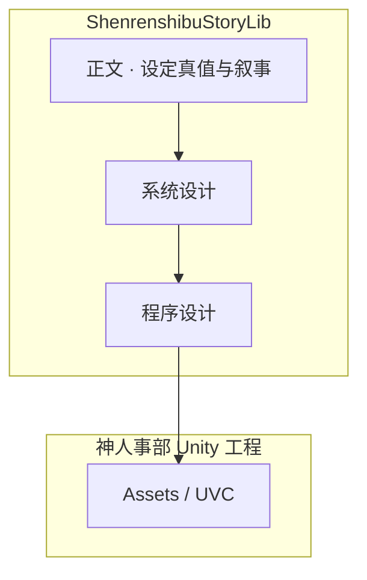

# 《神人事部》项目文档库总览

本仓库（**ShenrenshibuStoryLib**）是《神人事部》的**统一文档库**：自叙事设定库扩展而来，并纳入 Unity 工程（[`神人事部`](../../../)）的系统设计、程序设计与工程约定。

Unity 侧仅保留 `Assets/` 运行时资源；**一切可版本化的设计说明与叙事真值均在本库**。

## 三分库（与机魂 `Docs/` 对齐）

| 库 | 路径 | 回答的问题 |
|----|------|------------|
| **系统设计** | [系统设计/](系统设计/README.md) | 玩起来是什么、规则意图、验收口径 |
| **程序设计** | [程序设计/](程序设计/README.md) | 代码与数据具体怎么做 |
| **正文** | [正文/](正文/00-START-HERE.md) | 世界观、叙事真值、生产稿、对外投放 |

## 阅读顺序（首次）

1. [程序设计/00-规范/00-文档约定.md](程序设计/00-规范/00-文档约定.md) — 命名与 REQ/IMPL 约定  
2. [系统设计/01-产品/产品愿景与边界.md](系统设计/01-产品/产品愿景与边界.md)  
3. [正文/00-START-HERE.md](正文/00-START-HERE.md) — 世界观与叙事分层  
4. [程序设计/01-架构总览/核心系统与核心循环.md](程序设计/01-架构总览/核心系统与核心循环.md)  

## 与 Unity 工程的关系

| 位置 | 版本控制 | 内容 |
|------|----------|------|
| 本仓库 | Git | 本文件及下属全部 Markdown |
| `神人事部/Assets/` | UVC | 脚本、场景、SO、美术 |
| `神人事部/Docs/` | Git（子模块指针） | 仅挂载本仓库 |

详见 [仓库布局.md](仓库布局.md)、[00-工程集成说明.md](00-工程集成说明.md)。

## 快速入口

| 我要…… | 去看 |
|--------|------|
| 需求列表 | [系统设计/02-需求/需求总览.md](系统设计/02-需求/需求总览.md) |
| 实现与代码路径 | [程序设计/04-实现/实现总览.md](程序设计/04-实现/实现总览.md) |
| REQ ↔ IMPL | [程序设计/文档配对索引.md](程序设计/文档配对索引.md) |
| 设定真值 / 叙事 | [正文/00-START-HERE.md](正文/00-START-HERE.md) |
| 追溯矩阵 | [程序设计/05-交付/交付-追溯矩阵.md](程序设计/05-交付/交付-追溯矩阵.md) |

## 修订记录

| 日期 | 说明 |
|------|------|
| 2026-05-26 | 升格为项目统一文档库；并入系统设计、程序设计（原 Unity `Docs/` 工程层） |
