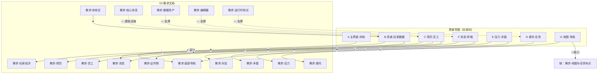

# 核心系统思维导图 · 需求层符合度对比表

| 字段 | 值 |
|------|-----|
| 对照来源 | `whiteboard_exported_image.pdf`（核心系统思维导图） |
| 对照基准 | **仅** `Docs/ShenrenshibuStoryLib/系统设计/02-需求/`（15 篇需求文档、51 条 `REQ-*`） |
| 关联总表 | [符合度结果对比表.md](./符合度结果对比表.md)（含实现/代码口径） |
| 最后更新 | 2026-05-18 |

> 本表回答：**导图上的玩法与系统，在需求层有没有写下来、写全了没有。** 不评价代码是否已实现。

---

## 图例

| 符号 | 需求层符合度 | 含义 |
|:----:|--------------|------|
| ● | **符合** | 至少有 1 条 P0 `REQ-*` 或需求文档「目标」段明确覆盖该导图节点 |
| ◐ | **部分符合** | 需求仅在目标/非功能/关联文档中间接提及，或 P1/P2 且缺验收口径 |
| ○ | **未覆盖** | 导图有节点，需求层无对应 `REQ-*` 与专篇 |
| — | **不适用** | 工程/工具向需求，导图未要求玩家可见能力 |

---

## 一、总览（需求模块 × 思维导图）

### 1.1 模块级统计

| 需求文档 | 模块键 | REQ 条数 | 导图主要对应 | 需求层符合度 | 导图→需求覆盖率* |
|----------|--------|:--------:|--------------|:------------:|:----------------:|
| 需求-底部导航.md | UI_Navigation | 3 | A 主界面、G 导航 | ◐ 部分 | 3/6 节点有 REQ |
| 需求-玩家经济与日历时钟.md | PlayerEconomy | 4 | B1 时间/资金、D 结算 | ● 符合 | 2/2 核心节点 |
| 需求-员工模型与标签Buff.md | Employee | 4 | B4、C 员工卡 | ◐ 部分 | 2/4 节点（缺人群互斥、隐藏标签 REQ） |
| 需求-委托系统.md | Assignment | 6 | D 委托任务 | ◐ 部分 | 8/18 节点有明确 REQ |
| 需求-矛盾系统.md | Conflict | 4 | E 矛盾 | ● 符合 | 3/4 节点 |
| 需求-压力系统.md | Stress | 4 | E 压力 | ◐ 部分 | 2/4 节点（性格匹配在 PES-004） |
| 需求-消息系统_邮件聊天日志.md | MessageSystem | 4 | B8 终端、F 消息 | ● 符合 | 7/9 节点 |
| 需求-对话播放系统.md | DialogSystem | 3 | F6 剧情演出、B3 进度 | ◐ 部分 | 1/2 节点 |
| 需求-简历窗口与交互.md | Resume | 3 | B2、C 简历 | ◐ 部分 | 3/5 节点 |
| 需求-证件照生成.md | Portrait | 2 | C 员工卡表现 | ◐ 部分 | 间接 |
| 需求-待命区.md | IdleArea | 3 | B6 休息区 | ● 符合 | 1/1 |
| 需求-核心消息与启动门控.md | CoreMessaging | 3 | （启动链） | — 不适用 | 导图未写门控 |
| 需求-数据资产与目录约定.md | DataAssets | 4 | C5、F4 配置 | ◐ 部分 | 支撑性 |
| 需求-编辑器工具链.md | EditorTools | 4 | F4 SO 创建 | — 不适用 | 策划工具 |
| 需求-运行时测试辅助.md | RuntimeTests | 3 | — | — 不适用 | 测试 |

\* **导图→需求覆盖率** = 该模块相关导图叶子中，至少有 REQ 或文档目标明确写到的比例（见第二节分表）。

### 1.2 需求层汇总数字（导图叶子 · 玩家向）

| 口径 | 数量 | 占比 |
|------|:----:|:----:|
| 导图玩家向叶子（计 62，不含图例/方法论） | 62 | 100% |
| ● 符合（有 P0 REQ 或专篇目标对齐） | 28 | **45.2%** |
| ◐ 部分符合 | 21 | **33.9%** |
| ○ 未覆盖（需求层缺口） | 13 | **21.0%** |

| 口径 | 数量 | 占比 |
|------|:----:|:----:|
| 现有 `REQ-*` 合计 | 51 | 100% |
| 与导图玩家能力直接对应 | 34 | 66.7% |
| 工程/数据/测试向（导图未画） | 17 | 33.3% |

---

## 二、思维导图 → 需求层对照表（主表）

| 导图分区 | 节点（摘要） | 符合度 | 覆盖的需求文档 / REQ | 需求层缺口 |
|----------|--------------|:------:|----------------------|------------|
| **A** | 主界面 | ◐ | `需求-底部导航` 目标段；无「标题场景主界面」专篇 | 缺 `需求-主菜单与场景流` |
| **A** | 设置 | ◐ | NAV 展开含设置；**无** REQ-NAV-00x 写设置项范围 | 缺 REQ-NAV-004 设置范围 |
| **A** | 开始游戏 | ○ | — | 缺 REQ-MENU-001 |
| **A** | 继续游戏 | ○ | NAV 有存档管理，**无**「继续」一键流程 REQ | 缺 REQ-MENU-002 |
| **A** | 存档初始化 / 读取 | ◐ | CNF-003、MSG-004、委托非功能「存档」；**无总存档 REQ** | 缺 `需求-存档与进度` |
| **A** | 结束游戏 | ● | REQ-NAV-002 退出 | — |
| **B** | 当前时间 / 资金 | ● | REQ-PES-001~003 | — |
| **B** | 简历池 | ◐ | REQ-RSM-001~002；**无**「简历生成/池刷新」REQ | 缺 REQ-RSM-004 生成规则 |
| **B** | 剧情进度 | ○ | DLG-002 仅会话记忆；**无**全局进度 REQ | 缺 REQ-PRG-001 或写入 PES/MSG |
| **B** | 员工数据 | ● | REQ-EMP-001~003 | — |
| **B** | 矛盾/压力/剧情事件 | ● | REQ-CNF-*、REQ-STR-*、MSG+DLG 目标 | — |
| **B** | 员工休息区 | ● | REQ-IDL-001~003 | — |
| **B** | 地图 | ○ | — | 缺 `需求-地图与任务布点` |
| **B** | 终端 | ● | REQ-MSG-001~002 | — |
| **C** | 拖简历 / 详情 | ● | REQ-RSM-002；REQ-RSM-003 动效 | — |
| **C** | 简历→员工卡 | ◐ | RSM 目标「与员工卡工厂协作」；**无**入职 REQ 条 | 缺 REQ-RSM-005 入职 |
| **C** | 标签列表 / 属性 Buff | ● | REQ-EMP-003 | — |
| **C** | 「人群」互斥筛选 | ○ | REQ-DAT-002 仅 tagId 唯一 | 缺 REQ-DAT-005 或 REQ-EMP-005 互斥表 |
| **C** | 隐藏标签 | ○ | — | 缺 REQ-RSM-006 / REQ-EMP-006 |
| **C** | 排序 / 伪冒泡 | ◐ | RSM 目标「排序」；**无**算法/周期 REQ | 缺 REQ-RSM-007 |
| **D** | 委托创建 / Tick / 结算 | ● | REQ-ASG-001~004 | — |
| **D** | 日常 / 常驻委托 | ○ | — | 缺 REQ-ASG-007 委托类型与刷新 |
| **D** | 开始任务（仅常驻） | ○ | ASG-006 就绪校验，**无**常驻限制 | 缺 REQ-ASG-008 |
| **D** | 叫停→失败 | ○ | 代码有 CancelTask；**需求未写** | 缺 REQ-ASG-009 |
| **D** | 员工工作状态（工/事/待命/休整） | ◐ | EMP-001 + ASG-004 间接 | 缺 REQ-EMP-007 状态与进度规则表 |
| **D** | 压力与任务进度联动 | ◐ | ASG-004「与矛盾/压力桥接」；STR 无任务内规则 REQ | 缺 REQ-STR-005 |
| **D** | 环节重试 / 失败 | ◐ | ASG-003 终态；**无**重试次数 REQ | 缺 REQ-ASG-010 |
| **D** | 日常周期发布 / 任务库 | ○ | 导图「生成逻辑需总结」 | 缺 REQ-ASG-011（待策划） |
| **D** | 协助三科解锁玩法 | ○ | — | 缺 REQ-UNL-* 或 ASG 支线 |
| **D** | 地图任务按钮 / X 标记 | ○ | — | 见地图专篇 |
| **D** | 随机地点生成 | ○ | — | 缺 REQ-ASG-012 |
| **D** | 职位属性→效率 | ● | ASG-004 验收要点 | — |
| **D** | 阶段 hook → 聊天/邮件 | ◐ | ASG 目标段；MSG/DLG 未写 hook 契约 | 缺 REQ-ASG-013 hook 验收 |
| **D** | 矛盾值满触发 | ● | REQ-ASG-005 + REQ-CNF-001 | — |
| **E** | 压力满 → buff/清零 | ◐ | STR-001~003；**无**满值事件 REQ 条文 | 缺 REQ-STR-005 |
| **E** | 性格→压力事件 | ◐ | REQ-PES-004 性格 ID；**STR 篇未写匹配** | 应在 STR 增 REQ-STR-006 |
| **E** | 矛盾满 / 邮件选项 / 标签 | ● | REQ-CNF-001、004 | — |
| **E** | 事件库选取逻辑 | ◐ | CNF 目标「模板池」；**无**权重/选取 REQ | 缺 REQ-CNF-005 |
| **E** | 模块托管发邮件 | ● | MSG-004 + CNF-004 | — |
| **F** | 邮件 / 聊天 / 日志 | ● | REQ-MSG-001~002 | — |
| **F** | 历史 / 存档消息 | ● | REQ-MSG-003~004 | — |
| **F** | 消息演出 / ChatStory | ● | MSG 目标 + REQ-DAT-001 | — |
| **F** | 频道 / 角色 / 剧情 SO | ◐ | REQ-DAT-001；EDT-001 创建路径 | — |
| **F** | 任务面板实时信息 | ○ | — | 缺 REQ-ASG-014 或 UI 专篇 |
| **F** | 群聊列表排序 | ○ | — | 缺 REQ-MSG-005 |
| **G** | 任务地点交互 | ○ | — | 见地图专篇 |
| **G** | 游戏内主界面 / 二级菜单 | ◐ | REQ-NAV-001~003 | 缺返回栈 REQ |
| **G** | 弹窗提示 | ○ | — | 缺 REQ-UI-001 事件弹窗 |

---

## 三、REQ 条目 → 思维导图反向对照

> 用于检查：**已写进需求的内容，导图里有没有画到。**

| REQ ID | 优先级 | 需求文档 | 导图对应节点 | 反向符合度 |
|--------|:------:|----------|--------------|:------------:|
| REQ-CORE-001~003 | P0/P1 | 核心消息 | （隐含）游戏内多系统协作 | — 基础设施 |
| REQ-PES-001~003 | P0 | 玩家经济 | B1 时间/资金；D 结算发钱 | ● |
| REQ-PES-004 | P1 | 玩家经济 | E2 性格（压力事件匹配） | ◐ |
| REQ-EMP-001~004 | P0/P1 | 员工 | B4、C 标签/状态；D6 间接 | ● / ◐ |
| REQ-ASG-001~006 | P0/P1 | 委托 | D3/D8/D9/D16/D18 | ◐（缺叫停/日常/地点） |
| REQ-CNF-001~004 | P0/P2 | 矛盾 | E3~E6 | ● / ◐ |
| REQ-STR-001~004 | P0/P1 | 压力 | E1、E7 部分 | ◐（缺满值事件、任务内规则） |
| REQ-MSG-001~004 | P0/P1 | 消息 | B8、F1~F5、F7 | ● |
| REQ-DLG-001~003 | P0/P1 | 对话 | F6；B3 仅间接 | ◐ |
| REQ-RSM-001~003 | P0/P2 | 简历 | B2、C1、C7 部分 | ◐ |
| REQ-POR-001~002 | P0/P1 | 证件照 | C 员工卡头像（导图未单列） | ◐ |
| REQ-IDL-001~003 | P0/P1 | 待命区 | B6 | ● |
| REQ-NAV-001~003 | P0/P1 | 底部导航 | A2、A6、G2~G3 | ◐ |
| REQ-DAT-001~004 | P0/P1 | 数据资产 | F4、C5 支撑 | — 支撑 |
| REQ-EDT-001~004 | P0/P2 | 编辑器 | — | — |
| REQ-TST-001~003 | P0/P1 | 运行时测试 | — | — |

---

## 四、交叉矩阵（导图分区 × 需求模块）

**读法**：行 = 思维导图分区；列 = `02-需求` 模块；单元格 = 该模块需求对该分区的覆盖程度。

| 导图分区 ↓ / 需求 → | NAV | PES | EMP | ASG | CNF | STR | MSG | DLG | RSM | POR | IDL | CORE | DAT | EDT | TST |
|---------------------|:---:|:---:|:---:|:---:|:---:|:---:|:---:|:---:|:---:|:---:|:---:|:---:|:---:|:---:|:---:|
| A 主界面·存档 | ◐ | ○ | ○ | ○ | ○ | ○ | ○ | ○ | ○ | ○ | ○ | ○ | ○ | ○ | ○ |
| B 场景·玩家数据 | ○ | ● | ● | ○ | ○ | ○ | ● | ◐ | ◐ | ○ | ● | ◐ | ◐ | ○ | ○ |
| C 简历·员工 | ○ | ○ | ● | ○ | ○ | ○ | ○ | ○ | ◐ | ◐ | ○ | ○ | ◐ | ○ | ○ |
| D 委托·任务 | ○ | ◐ | ◐ | ◐ | ● | ◐ | ◐ | ◐ | ○ | ○ | ○ | ◐ | ○ | ○ | — |
| E 压力·矛盾 | ○ | ◐ | ◐ | ◐ | ● | ◐ | ● | ○ | ○ | ○ | ○ | ◐ | ○ | ○ | ○ |
| F 消息·终端 | ○ | ○ | ○ | ◐ | ◐ | ○ | ● | ● | ○ | ○ | ○ | ○ | ● | ◐ | ○ |
| G 地图·导航 | ◐ | ○ | ○ | ○ | ○ | ○ | ○ | ○ | ○ | ○ | ○ | ○ | ○ | ○ | ○ |

---

## 五、需求层缺口 backlog（建议新增 REQ）

| 优先级 | 建议 ID / 文档 | 对应导图节点 | 说明 |
|:------:|----------------|--------------|------|
| P0 | `需求-主菜单与场景流` · REQ-MENU-001/002 | A3/A4 | 开始游戏、继续游戏、场景加载顺序 |
| P0 | `需求-存档与进度` · REQ-SAV-001~003 | A5、B3 | 总存档编排、读档一致性、剧情进度字段 |
| P0 | REQ-ASG-009 | D5 | 叫停任务 = 失败（与实现对齐） |
| P0 | REQ-ASG-011 | D10 | 日常委托周期发布（策划定稿后写验收） |
| P1 | REQ-ASG-007/008/010/012~014 | D2/D4/D8/D15/F8 | 委托类型、常驻限制、重试、地点、面板信息 |
| P1 | REQ-STR-005/006 | D7、E1、E2 | 任务内压力规则、满值性格事件（从 PES-004 拆清） |
| P1 | REQ-RSM-005~007 | C2/C6/C7 | 入职、隐藏标签、排序规则 |
| P1 | REQ-EMP-005~007 | C5、D6 | 人群互斥、隐藏标签、状态-进度表 |
| P1 | REQ-MSG-005 | F9 | 聊天/群聊列表排序 |
| P2 | `需求-地图与任务布点` | B7、D14、G1 | 世界任务块、X 标记、随机地点 |
| P2 | REQ-UNL-* 或 ASG 支线 | D11~D13 | 三科协助解锁（确认是否仍要） |
| P2 | REQ-NAV-004、REQ-UI-001 | A2、G3、G4 | 设置范围、弹窗/返回栈 |

---

## 六、与「全栈符合度表」的差异说明

| 维度 | 全栈表（实现+代码） | 本表（仅需求层） |
|------|---------------------|------------------|
| 符合率（导图叶子） | 约 62.5% | **约 45.2%** |
| 典型升高项 | 代码已有但 REQ 未写：叫停任务、隐藏标签、满值压力事件 | — |
| 典型一致缺口 | 开始/继续、日常发布、三科解锁、地图随机点 | 同左，需先补 REQ 再开发 |

---

*维护：导图或 `02-需求` 变更后，同步更新第二节主表与第一节覆盖率。*
