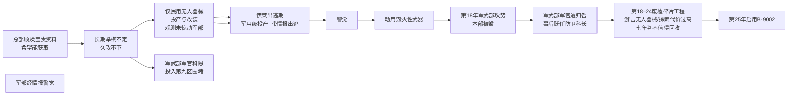

---

## title: 前任管理员事变后年表与真值分层增补（拟并入正文）
status: archived
visibility: internal
archived_on: 2026-05-19
merged_into:
  - TIM-04
  - SYS-PREV-BRIDGE
aligns:
  - 设定设计/设定真值/40-时序与历史/TIM-04-前任管理员执政与第九区事态背景年表.md
  - 设定设计/设定真值/10-百科/系统/SYS-PREV-BRIDGE-前任管理员与第九区废墟事变.md

# 前任管理员事变后年表与真值分层增补（草稿）

> **已归档（2026-05-19）**：内容已并入 [TIM-04](../../../../设定真值/40-时序与历史/TIM-04-前任管理员执政与第九区事态背景年表.md) 与 [SYS-PREV-BRIDGE](../../../../设定真值/10-百科/系统/SYS-PREV-BRIDGE-前任管理员与第九区废墟事变.md)。本稿仅留痕。

## 第一条　因果链（作者用）

> **替罪羊线措辞依据**（用户原意）：上级顾及前任管理员身上**宝贵资料**、希望能获取 → **一直举棋不定**、久攻不下 → 此间前任管理员**仅**投产与改装**民用级无人器械**（即便被观测也**未**引起军部警惕）→ **伊莱出逃时期**才开始**军用级无人器械**投产 → 军部经伊莱情报**惊觉** → 动用**毁灭性武器**清剿 → 因双面砧机密，**第 18 年攻势时**表面归咎**军武部军官**、现场指挥 **科恩·沃洛克**「处置不力」（**此时还不是**防卫科科长）；**事后**贬入人事部第九区分部任防卫科科长，对外替罪叙事延续。掩盖总部决策失误。

**要点**：

- 拖延的主因是总部**举棋不定**（要宝贵资料、又怕打烂），**不是**「科恩申请加重火力被驳回」。
- **第 15 末–第 17 年**：前任管理员侧只有**民用级**无人器械产线与改装；一线可见、可被观测，**不足以**让军部按「军用级威胁」立案。
- **军用级无人器械投产**：与**伊莱·索伦出逃**同一窗口（约第 17 年末–第 18 年初）才开始；**不是**举棋不定阶段就已量产军用级。
- 总部**警觉**并批准毁灭性武力，**主要**靠伊莱带出的**军用级已投产/正在投产**情报（兼借势 [ENT-AIBACKLASH](../../../../设定真值/10-百科/文化/ENT-AIBACKLASH-人工智能污名与第九区事变情绪遗产.md)）。

---

## 第二条　TIM-04 增补表（拟修订第三条相对年表）

**说明**：第 2–10 年、第 15 年「策动骚乱」等**既有行不动**；下表仅列**新增、拆分或改写**行。专名 **无人器械** 指正由 AI 托管运行的器械（含民用级与军用级两档）；**军用级**投产见第 17 年末–第 18 年初「伊莱出逃」行，此前仅**民用级**。

| 操作        | 年份（相对）                 | 拟写入要点                                                                                                                                                                                                                                                                                                                                                                                                                                                                               | 投放    | 玩家情报（拟） |
| --------- | ---------------------- | ----------------------------------------------------------------------------------------------------------------------------------------------------------------------------------------------------------------------------------------------------------------------------------------------------------------------------------------------------------------------------------------------------------------------------------------------------------------------------------- | ----- | --------- |
| **拆分**    | 谋划暴露后（约第 15 年末–第 17 年） | 企业武装压制前任管理员反叛；总部**顾及**前任管理员身上**宝贵资料**（含 **双面砧** 相关样本与 **无人器械** 产线信息），**希望能获取**，因而**一直举棋不定**，未能果断歼灭，现场**久攻不下**。此间前任管理员**仅**维持**民用级无人器械**的投产与改装（AI 托管）；即便被观测，**亦未**引起军部按军用威胁立案。**军武部**军官 **科恩·沃洛克** 作为现场指挥之一投入第九区围堵（非「申请升级火力被驳回」主线）。                                                                                                                                                                                                                                                           | 中层    | P2 |
| **保留并补充** | 第 15 年                 | （既有：征地、骚乱谋划。）**增补**：**摩恩夫人**因征地心灰意冷**卸任**服务科科长；卸任时**亲自**委任**下一任**科长（姓名留白），并将弟子 **艾萨克·穆尔** **调出服务科**，调往第九区**偏远地区**驻点任**精英科员**、兼**组长**（**非**上级问责；决定人：摩恩）。**瑟琳娜·昼** 已在人事部一线，受派系罪证档案束缚。前任管理员反叛意图**尚未公开**。                                                                                                                                                                                                                                                                                  | 中层    | P2 |
| **新增**    | 第 16–17 年              | 反叛意图逐步暴露；前线仍以**民用级无人器械**为主（与上条衔接）。艾萨克在**偏远驻点**履职。摩恩所委任之服务科科长**仍在任**（约自第 15 年起）。                                                                                                                                                                                                                                                                                                                                                                                                     | 中层    | P2 |
| **新增**    | 第 17 年末–第 18 年初        | **军用级无人器械**在此窗口**才开始投产**（与民用改装线衔接，属前任管理员与伊莱布局一环）。前任管理员 **桥专属人类顾问** **伊莱·索伦** 按布局**假叛逃**；向军部/总部提供 **无人器械已部署、军用级已投产/正在投产** 情报，使军部**警觉**并打破「仅民用、可观望」的判断（借势社会对 AI 的恐惧，见 [ENT-AIBACKLASH](../../../../设定真值/10-百科/文化/ENT-AIBACKLASH-人工智能污名与第九区事变情绪遗产.md)）。**上交损毁母带**；私藏另一容器内**完整前任管理员副本**（公司不知，深层）。                                                                                                                                                                                               | 深层    | P3 |
| **改写**    | 第 18 年                 | 军部经伊莱情报**警觉**军用级威胁后，批准动用**毁灭性武器**消灭前任管理员、清除隐患。**[军武部](../../../../设定真值/10-百科/组织/赫利俄斯/ORG-MILDEPT-军用武装管理部.md)** 以**军事级攻势**摧毁旧人事部中枢及相连反抗区域，废墟区由此形成。**人事部熟悉当地情况的骨干人员突然大量死亡导致人员空缺**。摩恩所委任之服务科科长于本部**阵亡**。**艾萨克·穆尔**人在**偏远驻点**，仍遭毁灭性打击**余震**波及，**失去双腿**（后装基础义腿；**非**服务科科长）。因 **ANVIL-BIFORM** 机密，**表面上**归咎时任**军武部军官**、现场指挥 **科恩·沃洛克**「处置不力」（**非**防卫科科长）、掩盖总部**举棋不定**及**未及时按军用威胁处置**的失误；**事后**科恩自军武部**贬出**，降职留任**人事部第九区分部** **防卫科**科长（**收拾烂摊子**）。**伊莱·索伦**因情报功过**踢出双面砧计划**、**委任人事部部长**主持重建。                    | 表层+中层 | P1–P2 |
| **新增**    | 第 18 年后（重组）            | 伊莱**逐个委任四科长**：科恩已贬留第九区分部防卫科 → 艾萨克约第 19–22 年**回任**服务科 → 瑟琳娜被以第一区罪证包**逼任**人力科长 → 凌薇于重组后约 1–3 年内自第一区**下放**财务科。                                                                                                                                                                                                                                                                                                                                                                         | 中层    | P1–P2 |
| **改写**    | 第 18–24 年（共 7 年）       | 废墟地下为**碎片化低级备份 + 写死指令的低级智能**（目标：重建可承载前任管理员的服务器）；同期 **军用级无人器械** 与产线节点藏于防空洞/地堡等，在 [废墟区](../../../../设定真值/10-百科/地点/PLC-RUINS-废墟区-第九区事变遗留片区.md) **专精游击**（伏击、诱杀、切断补给与通讯），作风**阴险狡诈**，使清剿与搜查**作战困难**。企业多次**强行探索**废墟（取样、拆机、追产线），**伤亡与装备损耗代价过于高昂**，难以持续。七年间未能稳定夺回地下工程或完整样本；**军部**经七年清剿与搜查，正式判**不值得回收** → 集团据此启动第二次实验 **B-9002**。**表层政务**由 **伊莱·索伦** 以部长身份主持重建（取代 TIM-04 现行「另案说明」）。废墟一带 **无人器械活动** 归因不明（伊莱已被踢出计划）。伊莱**私藏完整副本**（≠废墟碎片工程，深层）。艾萨克在基建维护期或经废墟 **②** 投射至 **无人器械上的低级智能体容器**（②之分身）**间接**接触（**未**接触①完整副本或前任管理员本体全能意识，深层）。 | 分层见下  | P0 结果 / P2 判因 / P3 智能 |
| **保留**    | 第 25 年                 | 启用现任 **B-9002**（既有条文不动）。                                                                                                                                                                                                                                                                                                                                                                                                                                                            | 表层    | P1 |

**用语**：正文若现「无人智能器械」，转正时与 **无人器械** 专名对齐。

---

## 第三条　SYS-PREV-BRIDGE 增补（拟修订第三–五条）

### 3.1 表层（第三条）增补句

- 对外可将第九区事变归咎于 **防卫延误**、**失控无人器械**、联合阵线/叛乱等集合标签；**不宜**写死科恩个人为唯一元凶（与中层替罪叙事分层）。

### 3.2 中层（第四条）拟新增或并入款

1. **宝贵资料与举棋不定**：谋划暴露后，总部**顾及**宝贵资料、**长期举棋不定**，未能果断结束战事；现场久攻不下。此间前任管理员**仅**维持**民用级无人器械**投产与改装；观测**不足以**触发军部军用级警惕。
2. **军用级与警觉**：**军用级无人器械**仅在**伊莱出逃时期**才开始投产；军部**主要**经伊莱情报**警觉**，方批准**毁灭性武器**清剿隐患。
3. **科恩替罪**：第 18 年攻势时科恩为**军武部军官**（现场指挥），**不是**防卫科科长。攻势后因 ANVIL-BIFORM 机密，**表面上**归咎其「处置不力」，**掩盖**总部举棋不定及**未及时按军用威胁升级**的失误；**事后**贬入**人事部第九区分部**任防卫科科长（降职留任、收拾烂摊子）。人物层：科恩对伊莱的态度主要来自**听令却被当弃子**、而伊莱因对外「背叛」前任管理员却**被重用**为部长的事后对比（见科恩 CHR），**非**战时知晓情报或战场表态。
4. **伊莱叛逃与军械情报**：约第 17 年末–第 18 年初，与**军用级投产**同期假叛；向军部提供部署与军用级情报，**触发**警觉；事后踢出双面砧、**委任人事部部长**主持重建。
5. **人事部熟悉当地情况的骨干人员突然大量死亡导致人员空缺**：第 18 年本部被毁导致各科、各派系执行业务骨干几近全灭；重建依赖地区分部幸存者与外部补缺（含凌薇下放、瑟琳娜逼任等，人物见 CHR 草稿）。
6. **第 18–24 年部长重建**：表层政务由伊莱·索伦以人类事务管理部部长身份主持；与 [ORG-HRDEPT](../../../../设定真值/10-百科/组织/赫利俄斯/ORG-HRDEPT-人类事务管理部.md) 对照。
7. **七年不值得回收（判因补充）**：废墟区**作战困难**；残存 **军用级无人器械** **专精游击**、**阴险狡诈**，长期牵制**军部**清剿与搜查。企业对废墟的**强行探索**（深入、反复取样、拆毁节点）**代价过于高昂**（人力、装备、舆论与合规成本），无法换得稳定样本或地下服务器工程；故七年清剿与搜查后，**军部**裁定**不值得回收**；集团改以 **B-9002** 第二次实验替代深入回收。

### 3.3 深层（第五条）拟改写为两条智能对照

在保留「前任管理员掌握无人产线/智能机器人工厂」总述前提下，**分列**（作者真值，禁止对玩家直述全貌）。**无人器械上的低级智能体容器**属于 **② 的对外延伸**，**不是**与①②并列的第三条线。

| 序号 | 所在 | 形态 | 说明 |
|------|------|------|------|
| ① | 伊莱私藏 | **完整**前任管理员副本（另一容器） | **全能型**本体级智能；公司不知；≠废墟工程 |
| ② | 废墟地下（含无人器械分身） | **碎片备份** + **低级智能**（写死指令、专精技能） | 见下表 |

**② 废墟侧智能（细分，作者用）**

| 要素 | 内容 |
|------|------|
| **低级智能** | **专精若干技能的功能性智能**（游击指挥、通道控制、产线维护等），**不是**①那种全能型本体。 |
| **记忆** | 仅保留**基础的、非机密**记忆碎片；故**能认识艾萨克**（前任管理员时代民生/基建往来）。 |
| **无人器械低级智能体容器** | ② 在废墟外的**分身/子节点**之一，装载于军用或民用 **无人器械**；艾萨克经维护、供电、废墟边缘接口与之接触，**不是**与①对话，也**不是**第三条独立意识。 |
| **七年结局** | 军用无人器械游击 + 强行探索代价过高 → **军部**判不值得回收 → 集团启动 B-9002 |

### 3.4 人物制度接口（拟新增 SYS-PREV 节，中层）

- **部长**：第 18 年后至第 25 年 B-9002 启用前，表层政务由 **伊莱·索伦** 主持（链 `CHR-SOLEN-ELI`）。  
- **四科**：科恩（防卫）、艾萨克（服务）、瑟琳娜（人力）、凌薇（财务）委任顺序见 TIM 表「第 18 年后（重组）」；制度分权见 [WLD-03](../../../../设定真值/00-基石/WLD-03-人事部分权结构总览.md)。  
- **情报筛选**：部长与四科可在制度上过滤上报 B-9002 的情报；玩家可获知上限见 [06-玩家情报层级与投放矩阵.md](../四科科长人设/06-玩家情报层级与投放矩阵.md)。  
- **本条不写**：①私藏、②分身接触、假叛全貌（归深层 / CHR P3）。

---

## 第四条　对外说法对照（作者用）

| 受众/密级    | 说法                                                        | 玩家情报 |
| -------- | --------------------------------------------------------- | -------- |
| 公众/低密级   | 旧灾难、废墟区、AI/叛乱标签；科恩「处置不力」                                  | P0–P1 |
| 剧情中后期    | 宝贵资料、举棋不定、民用/军用无人器械、伊莱情报警觉、毁灭性武器、科恩替罪；废墟游击、探索代价过高、七年不值得回收 | P2 |
| 仅作者/深层接口 | 两条智能对照（①完整副本；②废墟低级智能+无人器械分身）；艾萨克经②分身接触 | P3（可选） |

---

## 第五条　关联草稿

- [四科科长人设/00-索引与转正清单.md](../四科科长人设/00-索引与转正清单.md)  
- [06-玩家情报层级与投放矩阵.md](../四科科长人设/06-玩家情报层级与投放矩阵.md)、[07-正文框架适配预案.md](../四科科长人设/07-正文框架适配预案.md)  
- 各 `CHR-*.md`（摩恩、四科长、伊莱·索伦）

---

## 第六条　玩家情报列说明（拟并入 TIM-04）

- **列名**：`玩家情报`（取值 P0 / P1 / P2 / P3 / P1–P2 等）。  
- **定义**：B-9002在常规叙事中**通常可拼到的上限**；与「投放」列（作者真值分层）对照见 [06](../四科科长人设/06-玩家情报层级与投放矩阵.md) 第六条。  
- **P3 行**：须在 TIM 表或 CHR 中标「**可选支线**」，避免写入 `玩家投放` v0.1 默认披露包。  
- **合并 TIM-04 时**：保留 TIM 第一条「因果分层仍以 SYS-PREV 为准」，并增「玩家情报层级以治理 02 与 CHR 第二条为准」。

