# 开局主线剧情流程（教程至功能解锁）

## 第一条　范围

本条载**已拍板**的开局主线：自 **B-9002** 苏醒，至**简历工作区**、**常驻委托（人事组）**解锁为止的**节点顺序**、**类型**（教程／任务内／解锁）及**叙述要点**。台词、关卡与 UI 归 [叙事生产稿/](../../叙事生产稿/README.md)；制度与前史分别见 [SYS-B9002](../10-百科/系统/SYS-B9002-桥与玩家职能.md)、[TIM-04](../40-时序与历史/TIM-04-前任管理员执政与第九区事态背景年表.md)。长期压力与终局服从 [NAR-01](../20-叙事合同/NAR-01-主线张力与终局分型.md)。

**不含**：反 AI 游行等（草稿 [引导任务与反AI游行支线_转写稿](../../../.草稿-编写正文时不许修改/引导任务与反AI游行支线_转写稿.md)，未拍板）；前任管理员／部长 P2–P3 线（非开局必经）。

## 第二条　节点类型（图例）

导图**仅用填色区分类型**，不用分组框。

| 填色 | 类型 | 游戏表现 |
|------|------|----------|
| 黑底 | 入口 | 主线链起点 |
| 灰白 | 剧情节拍 | 叙事衔接；不一定对应单独 UI |
| 蓝 | 教程 | 教学弹层、界面引导、规则说明 |
| 绿 | 任务内 | 已接委托运行中的场景进度 |
| 黄 | 解锁功能 | 新系统或新入口开放 |

**黄底便签**为实现备注，不是独立流程步（见第六条）。

## 第三条　流程导图

主干自左向右；**绿链**为寻猫委托运行中的七步。

```mermaid
flowchart LR
  START([主线])
  W1[主角苏醒 · 林杜说明身份与使命]
  B2[指导玩家招募员工]
  W3[引荐摩恩女士]
  W4[摩恩女士委托：寻找一只猫]
  B5[指导玩家完成任务]
  G1[员工问邻居]
  G2[问到小孩追猫]
  G3[小孩带路]
  G4[进入废墟区]
  G5[废墟区边缘通风管道找猫]
  G6[找到猫 · 收队]
  G7[得到摩恩女士认可]
  W8[摩恩：引荐信致服务科科长]
  W9[林杜：凌薇已批服务科专项预算]
  W7[等待任务完成]
  Y8[解锁日常委托 · 服务科]
  D1[修水管]
  D2[捉奸]
  D3[找失物]
  B10a[林杜：员工压力 · 配置休整]
  B10b[任务内矛盾 · 玩家协调]
  W11[安排员工减少矛盾与压力]
  W12[林杜引荐人力科科长瑟琳娜]
  B13[瑟琳娜：开通简历池 · 选人入组]
  B14[瑟琳娜：介绍人事组常驻逻辑]
  Y13[解锁简历工作区]
  Y14[解锁常驻委托]

  START --> W1 --> B2 --> W3 --> W4 --> B5
  B5 --> G1 --> G2 --> G3 --> G4 --> G5 --> G6 --> G7
  G7 --> W8 --> W9 --> W7 --> Y8
  Y8 --> D1 & D2 & D3
  Y8 --> B10a --> B10b --> W11 --> W12
  W12 --> B13 --> B14 --> Y13 --> Y14

  classDef tutorial fill:#1951ed,color:#fff,stroke:#0d3a9e
  classDef mission fill:#46bb3a,color:#fff,stroke:#2d7a24
  classDef unlock fill:#e3ba11,color:#1a1a1a,stroke:#a8840a
  classDef story fill:#f5f5f5,color:#1f2329,stroke:#646a73
  classDef start fill:#1f2329,color:#fff,stroke:#000

  class B2,B5,B10a,B10b,B13,B14 tutorial
  class G1,G2,G3,G4,G5,G6,G7 mission
  class Y8,Y13,Y14 unlock
  class W1,W3,W4,W7,W8,W9,W11,W12,D1,D2,D3 story
  class START start
```

**阶段提要**

1. **苏醒与首委托**：林杜说明身份（[ORG-HRDEPT-SCO](../10-百科/组织/赫利俄斯/ORG-HRDEPT-SCO-特殊综合行动小组.md)）→ 招募教程 → [CHR-MOEN](../10-百科/人物/CHR-MOEN-摩恩夫人.md) 引荐 → 寻猫（服务科口径）。  
2. **寻猫（绿）**：调查至 [PLC-RUINS](../10-百科/地点/PLC-RUINS-废墟区-第九区事变遗留片区.md) 边缘 → 收队 → 摩恩认可。  
3. **接入服务科**：摩恩愿致函现任服务科科长 [CHR-ISAAC-MOELLER](../10-百科/人物/CHR-ISAAC-MOELLER-艾萨克·穆尔.md)；林杜告知 [CHR-LYNWEI-CHANDRA](../10-百科/人物/CHR-LYNWEI-CHANDRA-凌薇·钱德拉.md) 已批专项预算 → 结算 → **日常委托**（社区类示例）。  
4. **编制与人力科**：休整／矛盾协调教程 → [CHR-SERENA-DAY](../10-百科/人物/CHR-SERENA-DAY-瑟琳娜·昼.md) 开通简历池、选人入组，介绍**人事组**（常驻）逻辑 → **简历工作区**、**常驻委托**。

## 第四条　叙述详情

以下按时间顺序展开第三条各节点；**不**替代生产稿台词，只固定因果与信息投放。

### 4.1　苏醒与编入小组

B-9002自运维界面苏醒。**林杜**（监管／引导人）说明：你是企业辖下 **B-9002**，编制在人事部 **特殊综合行动小组**，职责是接委托、组人手、把现场做成可交付结果；本部四科各有硬闸，你须通过接口博弈而非「一令通吃」。教程引导玩家完成**首批招募**（岗位配置、编组上限等基础操作）。

### 4.2　摩恩与寻猫

林杜将玩家引见**摩恩夫人**（退休的前服务科科长，仍握旧区人脉）。摩恩以私人情面委托**寻猫**——名义上可挂服务科社区勤务。教程说明如何**接取并派遣**任务。

**任务内（绿链）**：组员问邻居 → 得知小孩曾追猫 → 请小孩带路 → 进入**废墟区边缘**（不深入禁区核心）→ 在**通风管道**附近找到猫 → 收队回报。

### 4.3　认可、引荐与预算

猫送回后，摩恩表示认可你的办事方式，并主动提出：愿意写一封**给现任服务科科长**的**引荐信**，说明小组可受托协助服务科的**社区工作**；你方可为组员正式**接取服务科口径的委托**（与摩恩私委托区分：此后为科室渠道）。

林杜随即补充制度侧信息：**财务科科长凌薇**已向服务科**划拨一笔专项预算**，用于这类社区勤务的外包与耗材；引荐信到位后，日常委托不会「无钱空转」。玩家在此后进入**任务结算**节拍。

### 4.4　日常委托（服务科）

系统**解锁日常委托**入口（服务科标签）。林杜用示例说明品类（如修水管、捉奸、找失物等，可并列展示），并强调：委托运行中可能出现**岗位矛盾与压力**，须学会**安排休整**与**编组内协调**——否则任务卡死或损耗失控。

### 4.5　人力科：瑟琳娜

林杜引见**人力科科长瑟琳娜·昼**（**非**「霍尔特」等虚构对接人；开局主线以 CHR 为准）。

**瑟琳娜**在科层会议上惯用读稿，与玩家单独对接时可使用原声（见 [CHR-SERENA-DAY](../10-百科/人物/CHR-SERENA-DAY-瑟琳娜·昼.md)）。她对玩家完成两件事：

1. **开通权限**：允许从**简历池**遴选人员，**加入特殊综合行动小组**编制，扩充你可调配的人手（对应系统**解锁简历工作区**）。  
2. **介绍人事组**：说明**常驻委托**（人事组任务池）的运作逻辑——来源、刷新节奏、与一次性日常委托的差异、编制与风险口径等（对应**解锁常驻委托**；教程中可用富文本**高亮关键词**）。

林杜此前关于「减少矛盾／压力」的提示，在此与简历选人、岗位配置形成衔接。

### 4.6　开局主线止点

玩家已具备：**服务科日常委托**（摩恩引荐 + 凌薇预算）、**简历池扩编**、**常驻人事组任务**。此后主线压力转入 [NAR-01](../20-叙事合同/NAR-01-主线张力与终局分型.md) 所定义的长期委托／灰区／资源收紧，不在本条展开。

## 第五条　设定锚点

| 元素 | 锚点 |
|------|------|
| B-9002 | [SYS-B9002](../10-百科/系统/SYS-B9002-桥与玩家职能.md) |
| 林杜 | 引导监管人 |
| 摩恩夫人 | [CHR-MOEN](../10-百科/人物/CHR-MOEN-摩恩夫人.md) |
| 服务科科长（引荐信收件人） | [CHR-ISAAC-MOELLER](../10-百科/人物/CHR-ISAAC-MOELLER-艾萨克·穆尔.md) |
| 财务科专项预算 | [CHR-LYNWEI-CHANDRA](../10-百科/人物/CHR-LYNWEI-CHANDRA-凌薇·钱德拉.md) |
| 人力科科长 | [CHR-SERENA-DAY](../10-百科/人物/CHR-SERENA-DAY-瑟琳娜·昼.md) |
| 四科摩擦 | [WLD-03](../00-基石/WLD-03-人事部分权结构总览.md)、[四科冲突与剧情线索](../../叙事生产稿/01-简报/人物/四科冲突与剧情线索.md) |

## 第六条　便签（实现备注）

| 挂靠节点 | 文本 |
|----------|------|
| 招募员工 | 你的杨婶（街区 NPC 称谓；生产稿可与「梁婶」统一） |
| 等待任务完成 | 0 点不让放入职位，对所有任务有效（零编制不可派遣） |
| 减少矛盾／压力 | 包括指引玩家让员工休整 |
| 瑟琳娜介绍人事组 | 富文本高亮某些关键词 |

## 第七条　关联条文

- [PCM-00](PCM-00-使用范围与边界.md)  
- [ORG-HRDEPT](../10-百科/组织/赫利俄斯/ORG-HRDEPT-人类事务管理部.md)  
- [叙事生产稿/03-节拍/主线开局-思维导图.md](../../叙事生产稿/03-节拍/主线开局-思维导图.md)（导图副本）
