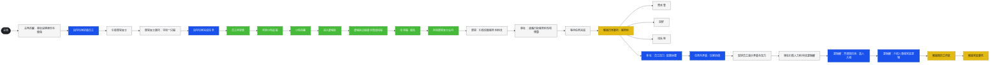

# 主线开局 · 思维导图（生产稿副本）

真值与**叙述详情**见 [PCM-01](../../设定真值/30-主角与主线/PCM-01-开局主线剧情流程.md) 第三、四条。

| 填色 | 类型 |
|------|------|
| 黑底 | 入口 |
| 灰白 | 剧情节拍 |
| 蓝 | 教程 |
| 绿 | 任务内 |
| 黄 | 解锁功能 |

```mermaid
flowchart LR
  START([主线])
  W1[主角苏醒 · 林杜说明身份与使命]
  B2[指导玩家招募员工]
  W3[引荐摩恩女士]
  W4[摩恩女士委托：寻找一只猫]
  B5[指导玩家完成任务]
  G1[员工问邻居]
  G2[问到小孩追猫]
  G3[小孩带路]
  G4[进入废墟区]
  G5[废墟区边缘通风管道找猫]
  G6[找到猫 · 收队]
  G7[得到摩恩女士认可]
  W8[摩恩：引荐信致服务科科长]
  W9[林杜：凌薇已批服务科专项预算]
  W7[等待任务完成]
  Y8[解锁日常委托 · 服务科]
  D1[修水管]
  D2[捉奸]
  D3[找失物]
  B10a[林杜：员工压力 · 配置休整]
  B10b[任务内矛盾 · 玩家协调]
  W11[安排员工减少矛盾与压力]
  W12[林杜引荐人力科科长瑟琳娜]
  B13[瑟琳娜：开通简历池 · 选人入组]
  B14[瑟琳娜：介绍人事组常驻逻辑]
  Y13[解锁简历工作区]
  Y14[解锁常驻委托]

  START --> W1 --> B2 --> W3 --> W4 --> B5
  B5 --> G1 --> G2 --> G3 --> G4 --> G5 --> G6 --> G7
  G7 --> W8 --> W9 --> W7 --> Y8
  Y8 --> D1 & D2 & D3
  Y8 --> B10a --> B10b --> W11 --> W12
  W12 --> B13 --> B14 --> Y13 --> Y14

  classDef tutorial fill:#1951ed,color:#fff,stroke:#0d3a9e
  classDef mission fill:#46bb3a,color:#fff,stroke:#2d7a24
  classDef unlock fill:#e3ba11,color:#1a1a1a,stroke:#a8840a
  classDef story fill:#f5f5f5,color:#1f2329,stroke:#646a73
  classDef start fill:#1f2329,color:#fff,stroke:#000

  class B2,B5,B10a,B10b,B13,B14 tutorial
  class G1,G2,G3,G4,G5,G6,G7 mission
  class Y8,Y13,Y14 unlock
  class W1,W3,W4,W7,W8,W9,W11,W12,D1,D2,D3 story
  class START start
```
