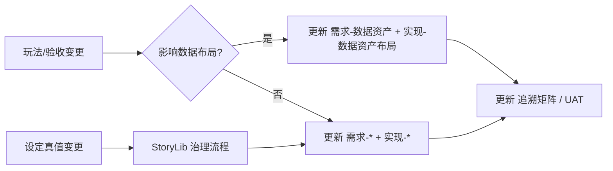

# 文档维护与版本策略

| 字段 | 内容 |
|------|------|
| 状态 | 已定稿（基线） |
| 最后更新 | 2026-05-26 |

## 1. 变更流程



| 步骤 | 责任人 | 产出 |
|------|--------|------|
| 1. 提案 | 策划/程序 | Issue 或 `02-需求` 段落 |
| 2. 需求定稿 | 主策 | `需求-<模块>.md` |
| 3. 实现 | 程序 | 代码 + `实现-<模块>.md` |
| 4. 验收 | 测试/主策 | `05-交付` UAT 勾选 |
| 5. 叙事 | 叙事 | StoryLib `设定真值` / `玩家投放` |

成对文档见 [文档配对索引](../文档配对索引.md)。

## 2. 文档元数据（推荐）

需求 / 实现文首可选表头：

| 字段 | 必填 |
|------|------|
| 状态 | draft / agreed / implemented / deferred |
| 最后更新 | YYYY-MM-DD |
| 模块键 | 与追溯矩阵一致 |

### 获取「最后更新」日期

```powershell
powershell -NoProfile -File Scripts/Get-DocsDate.ps1
```

## 3. Unity `.meta`

- 工程 Markdown 仅在 `Docs/`，**不产生** Unity `.meta`。  
- `Assets/` 内资源仍由 UVC 管理，`.meta` 随资源一并提交。

## 4. 路径规则

- 工程文档一律写在 `Docs/`，勿在 `Assets/00_Docs/` 新增正文（该处仅跳转 README）。  
- 改路径时同步 [文档配对索引](../文档配对索引.md) 与 `05-交付/交付-追溯矩阵.md`。

## 修订记录

| 日期 | 说明 |
|------|------|
| 2026-05-26 | 适配神人事部 REQ/IMPL 闭环与双根策略 |
