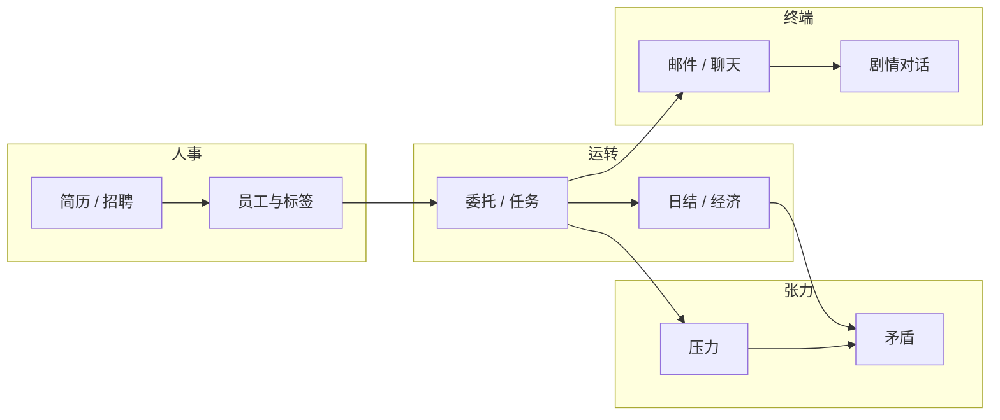
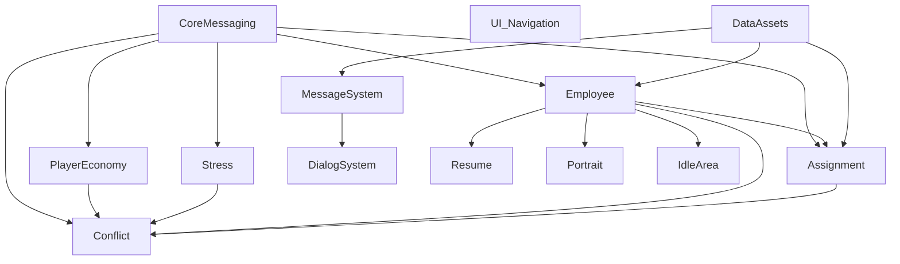

# 核心系统与核心循环（架构总图）

| 字段 | 内容 |
|------|------|
| 状态 | 已定稿（基线） |
| 最后更新 | 2026-05-26 |
| 关联 | [程序模块与文档结构](程序模块与文档结构.md)、`Docs/ShenrenshibuStoryLib/系统设计/03-计划/计划-模块依赖与建议顺序.md` |

本文是工程侧**横向架构**单一入口（原 `Docs/ShenrenshibuStoryLib/程序设计/01-架构总览/核心系统与核心循环.md` 的正式落点）。玩家语言版本见 [产品愿景与边界](../../系统设计/01-产品/产品愿景与边界.md)。

## 玩家主循环（摘要）

## 模块依赖（工程）

## 启动与门控

- 运行时依赖 `CoreMessaging` 发出初始化完成信号后，委托等系统才进入正常 Tick（详见 `实现-核心消息与启动门控`）。
- 测试场景可使用 `Tests/Runtime` 下 Bootstrap 跳过或模拟门控。

## 数据与表现

| 层 | 位置 |
|----|------|
| 策划 SO / 对话数据 | `Assets/04_Data/` |
| 运行时注册表 | 如 `EmployeeRuntimeDataRegistry` |
| UI 视图 | 各模块 `View/`、`MessageSystem/message/` |

目录细则：[06-引擎映射/Unity资源与数据目录.md](../06-引擎映射/Unity资源与数据目录.md)。

## 设定库边界

- **机制真值**（委托优先序、冲突规则等）：StoryLib `设定真值/10-百科/规则/`。  
- **任务简报与节拍**：`叙事生产稿/`、`30-主角与主线/`。  
- 程序实现不得与「设定真值」冲突；生产稿冲突时以真值为准。

## 修订记录

| 日期 | 说明 |
|------|------|
| 2026-05-26 | 从计划文档 mermaid 升格为架构总图；修复旧路径 404 |
