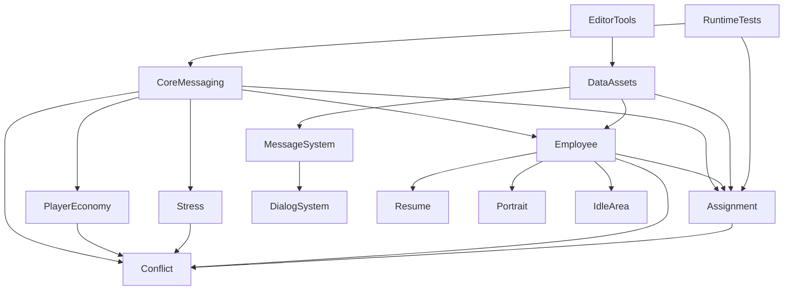

# 模块依赖与建议顺序（工程向）

> 用于拆分任务、评估联调成本；**非**玩家解锁顺序。

## 依赖图（摘要）

## 建议实现 / 联调顺序

1. **CoreMessaging** — 总线与门控；测试可用 `AssignmentTestBootstrap` 等。
2. **PlayerEconomy** + **Employee**（含 Tags）— 数据与 Buff 地基。
3. **Assignment** — 核心循环；与 Employee 注册表强相关。
4. **Stress** → **Conflict** — 网关与桥接依赖经济/压力。
5. **MessageSystem** — 叙事与 UI；**DialogSystem** 依赖聊天 UI 与存储。
6. **Resume / Portrait / IdleArea** — 人事 UI 与表现。
7. **UI_Navigation** — 全局壳层，可与 5/6 并行。
8. **DataAssets** — 与策划并行填充 `04_Data`；发布前核对测试资产剥离（`需求-数据资产与目录约定`）。
9. **EditorTools** — 随模块迭代扩展菜单与 Inspector；不改 Player 构建。
10. **RuntimeTests** — 联调委托/总线时使用；勿在正式发行场景默认开启。

## 风险登记（维护）

| 风险 | 影响模块 | 缓解 |
|------|-----------|------|
| 门控未发导致委托不创建 | Assignment | 场景检查 `RuntimeInitializationCompletedEvent`；测试关闭门控或 Bootstrap |
| 矛盾与委托对员工状态双重写入 | Conflict, Assignment | 以 `EmployeeRuntimeDataRegistry` 与桥接类为唯一变更入口审查 |
| `00_Data` 与 `04_Data` 双路径并存 | DataAssets, EditorTools | 统一默认创建路径或文档化「正式/草稿」分区；见 `实现-数据资产布局` |

